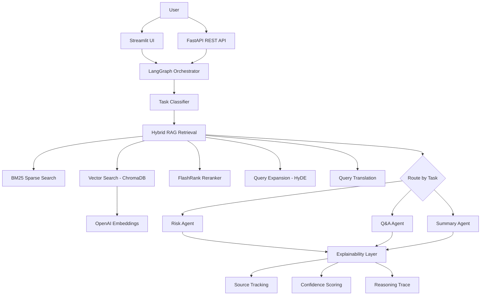

# LegalMind AI

[](https://www.python.org/downloads/)
[](https://fastapi.tiangolo.com)
[](https://langchain-ai.github.io/langgraph/)
[](https://docs.ragas.io/)
[](LICENSE)

**AI-powered legal document analysis** with advanced RAG, multi-agent system, and explainability layer.

Upload a contract (PDF/DOCX) and instantly get risk analysis, Q&A with source citations, and concise summaries — all with full transparency into how the AI reached its conclusions.

---

## Key Features

- **Document Ingestion** — PDF/DOCX parsing with smart parent-child chunking strategy (including table-heavy legal documents)
- **Hybrid RAG** — BM25 keyword + vector semantic search with FlashRank reranking
- **Multi-Agent System** — LangGraph DAG orchestrator with task classification and routing to specialized Risk, Q&A, and Summary agents
- **Query Expansion** — HyDE and multi-query generation for better retrieval
- **Cross-Language Query Translation** — Automatic query translation when document and query languages differ
- **Few-Shot Prompting** — All agents include curated few-shot examples for consistent, high-quality output
- **Explainability** — Source tracking, confidence scoring, and full reasoning traces
- **RAGAS Evaluation** — Automated quality measurement across 4 metrics + custom hit rate & MRR (configurable judge model)
- **REST API** — FastAPI backend with OpenAPI docs at `/docs`
- **Interactive UI** — Streamlit frontend with risk visualization charts and chat interface
- **LLM Fallback** — Automatic OpenAI -> Ollama fallback with rate limiting and retry logic
- **Docker Ready** — One-command deployment with `docker-compose`

---

## Architecture



---

## Tech Stack

| Component         | Technology                             |
|-------------------|----------------------------------------|
| LLM               | OpenAI GPT-4o-mini (+ Ollama fallback) |
| Embeddings        | text-embedding-3-small                 |
| Vector Store      | ChromaDB (persistent)                  |
| Sparse Search     | BM25 (rank-bm25)                       |
| Reranker          | FlashRank                              |
| Orchestration     | LangGraph (DAG workflow)               |
| Evaluation        | RAGAS + LangChain (judge wrapper)      |
| Backend           | FastAPI + Pydantic                     |
| Frontend          | Streamlit + Plotly                     |
| Logging           | Loguru                                 |
| Containerization  | Docker + Docker Compose                |

---

## Quick Start

### Prerequisites

- Python 3.11+
- [Poetry](https://python-poetry.org/)
- OpenAI API key

### Installation

```bash
# Clone the repository
git clone https://github.com/yourusername/legalmind.git
cd legalmind

# Install dependencies
poetry install

# Set up environment variables
cp .env.example .env
# Edit .env and add your OPENAI_API_KEY
```

### Run

```bash
# Option 1: Streamlit UI (standalone)
poetry run streamlit run ui/app.py

# Option 2: FastAPI backend
poetry run uvicorn api.main:app --reload
# Visit http://localhost:8000/docs for Swagger UI

# Option 3: Docker
docker-compose up --build
# API: http://localhost:8000 | UI: http://localhost:8501
```

---

## Project Structure

```
legalmind/
├── config/              # Settings (Pydantic) and prompt templates (YAML)
├── src/
│   ├── ingestion/       # Document loading, chunking, embeddings
│   ├── retrieval/       # Hybrid search, reranking, query expansion, translation
│   ├── agents/          # LangGraph orchestrator + specialized agents
│   ├── llm/             # LLM provider with fallback and rate limiting
│   ├── evaluation/      # RAGAS metrics, evaluator, and synthetic test generation
│   ├── explainability/  # Source tracking, confidence scoring, reasoning traces
│   └── utils/           # Logging (Loguru) and helpers
├── api/                 # FastAPI REST backend with routes
├── ui/                  # Streamlit frontend with components
├── tests/               # Pytest test suite
├── data/                # Vector store, sample contracts, eval data
├── notebooks/           # Jupyter notebooks for exploration
└── docs/                # Architecture and API documentation
```

---

## API Endpoints

| Method | Endpoint            | Description                  |
|--------|---------------------|------------------------------|
| POST   | `/upload`           | Upload PDF/DOCX document     |
| POST   | `/analyze/risks`    | Run risk analysis            |
| POST   | `/analyze/summary`  | Generate contract summary    |
| POST   | `/query`            | Ask a question about a doc   |
| GET    | `/health`           | Health check                 |

### Example: Upload and Analyze

```bash
# Upload a contract
curl -X POST http://localhost:8000/upload \
  -F "file=@contract.pdf"

# Analyze risks
curl -X POST http://localhost:8000/analyze/risks \
  -H "Content-Type: application/json" \
  -d '{"document_id": "your-doc-id"}'

# Ask a question
curl -X POST http://localhost:8000/query \
  -H "Content-Type: application/json" \
  -d '{"document_id": "your-doc-id", "question": "What is the termination period?"}'
```

---

## RAG Pipeline

The retrieval pipeline uses a hybrid approach for maximum relevance:

1. **Cross-Language Translation** (automatic) — Detects query/document language mismatch and translates queries for accurate retrieval
2. **Query Expansion** (optional) — HyDE generates hypothetical answers; multi-query generates alternative phrasings
3. **Hybrid Search** — BM25 keyword search + ChromaDB vector search, scores normalized and combined (60/40 weight)
4. **Reranking** — FlashRank reranks top candidates for precision
5. **Parent Document Retrieval** — Child chunks mapped back to parent chunks for richer context

---

## Multi-Agent System

The LangGraph orchestrator implements a **DAG workflow** (classify -> retrieve -> route -> agent):

- **Task Classifier** — LLM-based intent classification that routes to the correct agent
- **Risk Agent** — Identifies contract risks across 8 categories (liability, termination, IP, confidentiality, indemnification, non-compete, payment, data privacy) with severity ratings
- **Q&A Agent** — Answers questions with source citations and confidence scores
- **Summary Agent** — Generates 5-7 sentence summaries with key points, parties, and contract type

All agents use **few-shot prompting** with curated legal examples and return **structured JSON** with full source tracking.

---

## Evaluation

Quality metrics measured with RAGAS (configurable judge model, separate from generator):

| Metric             | Target | Description                        |
|--------------------|--------|------------------------------------|
| Faithfulness       | > 0.80 | Is the answer grounded in sources? |
| Answer Relevancy   | > 0.80 | Does it answer the question?       |
| Context Precision  | > 0.80 | Are retrieved chunks relevant?     |
| Context Recall     | > 0.80 | Were all relevant chunks found?    |
| Hit Rate           | > 0.80 | Does correct context appear?       |
| MRR                | > 0.70 | Rank of first relevant result      |

---

## Configuration

All settings are managed via environment variables (`.env`) and Pydantic:

| Variable                 | Default                   | Description                       |
|--------------------------|---------------------------|-----------------------------------|
| `OPENAI_API_KEY`         | —                         | OpenAI API key                    |
| `OPENAI_CHAT_MODEL`      | `gpt-4o-mini`             | Chat/generation model             |
| `OPENAI_EMBEDDING_MODEL` | `text-embedding-3-small`  | Embedding model                   |
| `RAGAS_JUDGE_MODEL`      | `gpt-4o-mini`             | RAGAS evaluation judge model      |
| `CHUNK_SIZE`             | `512`                     | Child chunk size (chars)          |
| `RETRIEVAL_TOP_K`        | `5`                       | Number of results                 |
| `HYBRID_ALPHA`           | `0.6`                     | Vector search weight              |
| `RERANKER_MODEL`         | `rank-T5-flan`            | FlashRank model                   |

See [.env.example](.env.example) for all options.

---

## Future Improvements

- LangSmith integration for production observability
- Streaming responses for real-time token generation
- ReAct agent loop with tools (contract search, clause comparison, date calculation)
- Contract comparison mode (diff two versions)
- User profiles and document history (SQLite/PostgreSQL)
- PDF report export
- Redis caching for frequent queries

---

## License

MIT
