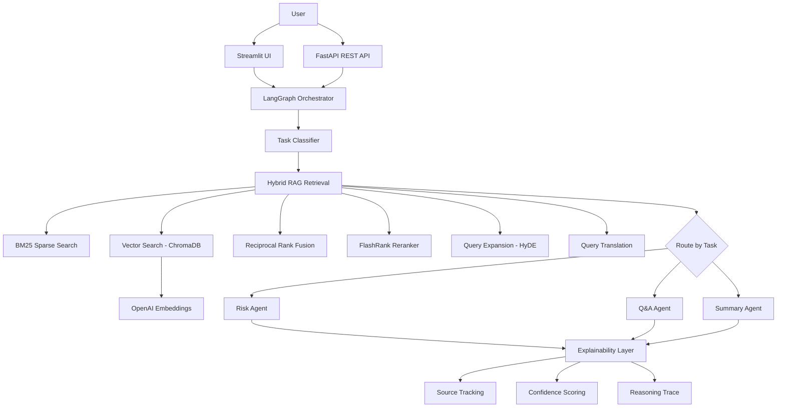

# LegalMind AI

[](https://www.python.org/downloads/)
[](https://fastapi.tiangolo.com)
[](https://langchain-ai.github.io/langgraph/)
[](https://docs.ragas.io/)
[](LICENSE)

**AI-powered legal document analysis** with advanced RAG, multi-agent system, and explainability layer.

Upload a contract (PDF/DOCX) and instantly get risk analysis, Q&A with source citations, and concise summaries — all with full transparency into how the AI reached its conclusions.

---

## Key Features

- **Document Ingestion** — PDF/DOCX parsing with smart parent-child chunking strategy and legal-aware separators (Section/Article/Clause boundaries)
- **Hybrid RAG** — BM25 keyword + vector semantic search fused via Reciprocal Rank Fusion (RRF) with FlashRank reranking and score threshold filtering
- **Multi-Agent System** — LangGraph DAG orchestrator with task classification and routing to specialized Risk, Q&A, and Summary agents
- **Query Expansion** — HyDE + multi-query generation (both enabled by default) with cross-query RRF fusion for better retrieval recall
- **Query Embedding Prefix** — Instruction-prefixed query embeddings for asymmetric retrieval (queries vs documents)
- **Cross-Language Query Translation** — Automatic query translation when document and query languages differ
- **Few-Shot Prompting** — All agents include curated few-shot examples for consistent, high-quality output
- **Explainability** — Source tracking, confidence scoring, and full reasoning traces
- **RAGAS Evaluation** — Automated quality measurement across 4 RAGAS metrics + custom hit rate & MRR with fuzzy token matching; exponential backoff for rate limit resilience
- **REST API** — FastAPI backend with OpenAPI docs at `/docs`
- **Interactive UI** — Streamlit frontend with risk visualization charts and chat interface
- **LLM Fallback** — Automatic OpenAI -> Ollama fallback with rate limiting and retry logic
- **Docker Ready** — One-command deployment with `docker-compose`

---

## Architecture


```mermaid
graph TB
    User[User] --> UI[Streamlit UI]
    User --> API[FastAPI REST API]
    UI --> Orch[LangGraph Orchestrator]
    API --> Orch

    Orch --> Classify[Task Classifier]
    Classify --> Retrieve[Hybrid RAG Retrieval]

    Retrieve --> BM25[BM25 Sparse Search]
    Retrieve --> Vec[Vector Search - ChromaDB]
    Retrieve --> RRF[Reciprocal Rank Fusion]
    Retrieve --> Rerank[FlashRank Reranker]
    Retrieve --> QE[Query Expansion - HyDE]
    Retrieve --> QT[Query Translation]

    Vec --> Embed[OpenAI Embeddings]

    Retrieve --> Route{Route by Task}
    Route --> Risk[Risk Agent]
    Route --> QA[Q&A Agent]
    Route --> Summary[Summary Agent]

    Risk --> Explain[Explainability Layer]
    QA --> Explain
    Summary --> Explain

    Explain --> Sources[Source Tracking]
    Explain --> Conf[Confidence Scoring]
    Explain --> Trace[Reasoning Trace]
```

---

## Tech Stack

| Component         | Technology                             |
|-------------------|----------------------------------------|
| LLM               | OpenAI GPT-4o-mini (+ Ollama fallback) |
| Embeddings        | text-embedding-3-large                 |
| Vector Store      | ChromaDB (persistent)                  |
| Sparse Search     | BM25 (rank-bm25)                       |
| Score Fusion      | Reciprocal Rank Fusion (RRF)           |
| Reranker          | FlashRank                              |
| Orchestration     | LangGraph (DAG workflow)               |
| Evaluation        | RAGAS + custom metrics (hit rate, MRR) |
| Backend           | FastAPI + Pydantic                     |
| Frontend          | Streamlit + Plotly                     |
| Logging           | Loguru                                 |
| Containerization  | Docker + Docker Compose                |

---

## Quick Start

### Prerequisites

- Python 3.11+
- [Poetry](https://python-poetry.org/)
- OpenAI API key

### Installation

```bash
# Clone the repository
git clone https://github.com/yourusername/legalmind.git
cd legalmind

# Install dependencies
poetry install

# Set up environment variables
cp .env.example .env
# Edit .env and add your OPENAI_API_KEY
```

### Run

```bash
# Option 1: Streamlit UI (standalone)
poetry run streamlit run ui/app.py

# Option 2: FastAPI backend
poetry run uvicorn api.main:app --reload
# Visit http://localhost:8000/docs for Swagger UI

# Option 3: Docker
docker-compose up --build
# API: http://localhost:8000 | UI: http://localhost:8501
```

---

## Project Structure

```
legalmind/
├── config/              # Settings (Pydantic) and prompt templates (YAML)
├── src/
│   ├── ingestion/       # Document loading, chunking, embeddings
│   ├── retrieval/       # Hybrid search (RRF), reranking, query expansion
│   ├── agents/          # LangGraph orchestrator + specialized agents
│   ├── llm/             # LLM provider with fallback and rate limiting
│   ├── evaluation/      # RAGAS metrics, evaluator, synthetic test generation
│   ├── explainability/  # Source tracking, confidence scoring, reasoning traces
│   └── utils/           # Logging (Loguru) and helpers
├── api/                 # FastAPI REST backend with routes
├── ui/                  # Streamlit frontend with components
├── scripts/             # CLI tools for evaluation and testset generation
├── tests/               # Pytest test suite
├── data/                # Vector store, sample contracts, eval data
├── notebooks/           # Jupyter notebooks for exploration
└── docs/                # Architecture and API documentation
```

---

## API Endpoints

| Method | Endpoint            | Description                  |
|--------|---------------------|------------------------------|
| POST   | `/upload`           | Upload PDF/DOCX document     |
| POST   | `/analyze/risks`    | Run risk analysis            |
| POST   | `/analyze/summary`  | Generate contract summary    |
| POST   | `/query`            | Ask a question about a doc   |
| GET    | `/health`           | Health check                 |

### Example: Upload and Analyze

```bash
# Upload a contract
curl -X POST http://localhost:8000/upload \
  -F "file=@contract.pdf"

# Analyze risks
curl -X POST http://localhost:8000/analyze/risks \
  -H "Content-Type: application/json" \
  -d '{"document_id": "your-doc-id"}'

# Ask a question
curl -X POST http://localhost:8000/query \
  -H "Content-Type: application/json" \
  -d '{"document_id": "your-doc-id", "question": "What is the termination period?"}'
```

---

## RAG Pipeline

The retrieval pipeline uses a hybrid approach for maximum relevance:

1. **Cross-Language Translation** (automatic) — Detects query/document language mismatch and translates queries for accurate retrieval
2. **Query Expansion** (HyDE + multi-query, both enabled by default) — HyDE generates hypothetical contract clauses for better semantic matching; multi-query generates 3 alternative phrasings. Results from all queries are fused via **cross-query RRF** so chunks found by multiple query variations get boosted
3. **Hybrid Search** — BM25 keyword search + ChromaDB vector search with instruction-prefixed query embeddings, combined via Reciprocal Rank Fusion (RRF) with configurable alpha weighting (70/30 vector/BM25)
4. **Reranking** — FlashRank aggressively reranks top 20 candidates down to top 5 for high precision; chunks below score threshold (0.05) are dropped
5. **Parent Document Retrieval** — Child chunks mapped back to parent chunks for richer context

### Chunking Strategy

Documents are split using a **parent-child chunking** approach with legal-aware separators:

- **Parent chunks**: 1536 chars with 384 char overlap (broad context for answer generation)
- **Child chunks**: 512 chars with 192 char overlap (precise units for embedding/search)
- **Legal separators**: `Section`, `Article`, `Clause` boundaries, semicolons (legal enumerations), then standard paragraph/sentence splits

---

## Multi-Agent System

The LangGraph orchestrator implements a **DAG workflow** (classify -> retrieve -> route -> agent):

- **Task Classifier** — LLM-based intent classification that routes to the correct agent
- **Risk Agent** — Identifies contract risks across 8 categories (liability, termination, IP, confidentiality, indemnification, non-compete, payment, data privacy) with severity ratings
- **Q&A Agent** — Answers questions with source citations and confidence scores; directly answers the question first, then provides supporting details
- **Summary Agent** — Generates 5-7 sentence summaries with key points, parties, and contract type

All agents use **few-shot prompting** with curated legal examples and return **structured JSON** with full source tracking.

---

## Evaluation

### Running Evaluation

```bash
# Generate a synthetic testset from a contract
python scripts/generate_testset.py --file data/sample_contracts/contract.pdf

# Run baseline evaluation (ground truth, no retrieval)
python scripts/run_eval.py

# Run full pipeline evaluation (retriever + QA agent)
python scripts/run_eval.py --mode pipeline
```

### RAGAS Metrics

Quality metrics measured with RAGAS (gpt-4o as judge, with exponential backoff for rate limit resilience) on the bundled NDA synthetic testset:

| Metric             | Score  | Target | Description                        |
|--------------------|--------|--------|------------------------------------|
| Faithfulness       | 1.0000 | > 0.80 | Is the answer grounded in sources? |
| Answer Relevancy   | 0.6160 | > 0.80 | Does it answer the question?       |
| Context Precision  | 0.3889 | > 0.80 | Are retrieved chunks relevant?     |
| Context Recall     | 0.5278 | > 0.80 | Were all relevant chunks found?    |
| Hit Rate           | 0.5556 | > 0.80 | Does correct context appear?       |
| MRR                | 0.4815 | > 0.70 | Rank of first relevant result      |

### Custom Metrics

Hit rate and MRR use a multi-strategy matching approach:

1. **Substring containment** — exact text match
2. **Token containment** — 70%+ of ground truth tokens found in retrieved chunk
3. **Jaccard similarity** — token overlap above 0.3 threshold

Rate limit handling: `max_retries=10` with exponential backoff on all LLM/embedding calls, `batch_size=2` for RAGAS evaluation, per-sample NaN logging for diagnostics.

---

## Configuration

All settings are managed via environment variables (`.env`) and Pydantic:

| Variable                 | Default                   | Description                       |
|--------------------------|---------------------------|-----------------------------------|
| `OPENAI_API_KEY`         | —                         | OpenAI API key                    |
| `OPENAI_CHAT_MODEL`      | `gpt-4o-mini`             | Chat/generation model             |
| `OPENAI_EMBEDDING_MODEL` | `text-embedding-3-large`  | Embedding model                   |
| `RAGAS_JUDGE_MODEL`      | `gpt-4o`                  | RAGAS evaluation judge model      |
| `CHUNK_SIZE`             | `512`                     | Child chunk size (chars)          |
| `CHUNK_OVERLAP`          | `192`                     | Overlap between chunks (chars)    |
| `RETRIEVAL_TOP_K`        | `20`                      | Candidates to retrieve before reranking |
| `HYBRID_ALPHA`           | `0.7`                     | Vector search weight (RRF)        |
| `RERANKER_MODEL`         | `rank-T5-flan`            | FlashRank model                   |
| `RERANKER_TOP_N`         | `5`                       | Results after reranking           |
| `RERANKER_SCORE_THRESHOLD` | `0.05`                  | Drop chunks below this score      |

See [.env.example](.env.example) for all options.

---

## Future Improvements & Roadmap

- **Short-term (next milestone)**:
  - Expand synthetic evaluation dataset to multiple contract types (NDA, MSA, DPA, employment agreements).
  - Add per-sample evaluation reports (questions, retrieved chunks, first relevant rank) to debug low Context Precision/Recall.
  - Tune retrieval parameters (BM25 tokenization, reranker thresholds, top-k) to steadily increase Context Precision/Recall, Hit Rate, and MRR on multi-document benchmarks.
- **Mid-term**:
  - LangSmith (or similar) integration for production observability and tracing.
  - Streaming responses for real-time token generation in the UI.
  - ReAct-style agent loop with tools (contract search, clause comparison, date calculation).
- **Long-term**:
  - Contract comparison mode (diff two versions with change explanation).
  - User profiles and document history (SQLite/PostgreSQL) with access control.
  - PDF report export and scheduled email reports.
  - Redis (or similar) caching layer for frequent queries and hot documents.

---

## License

MIT
